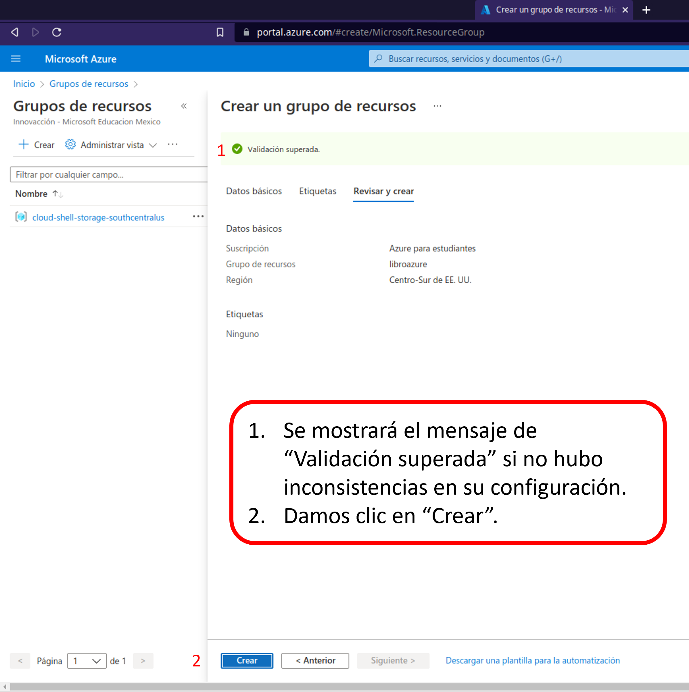
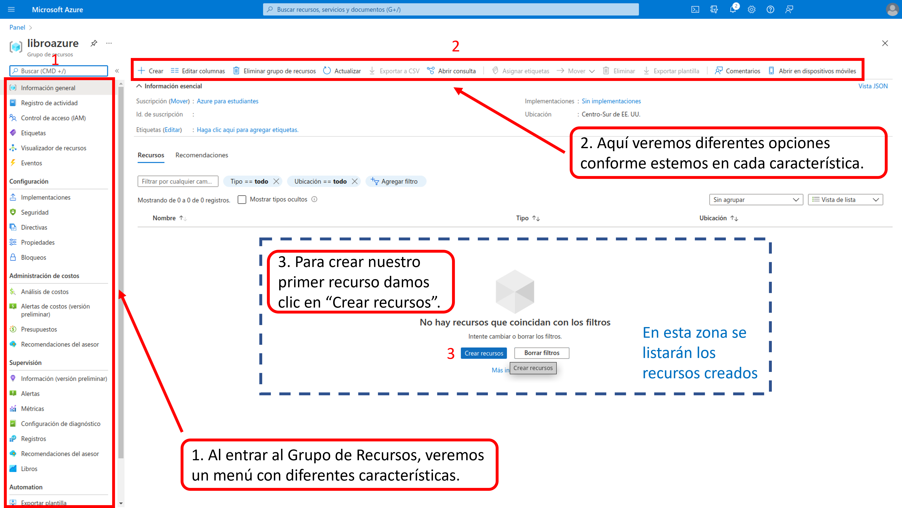
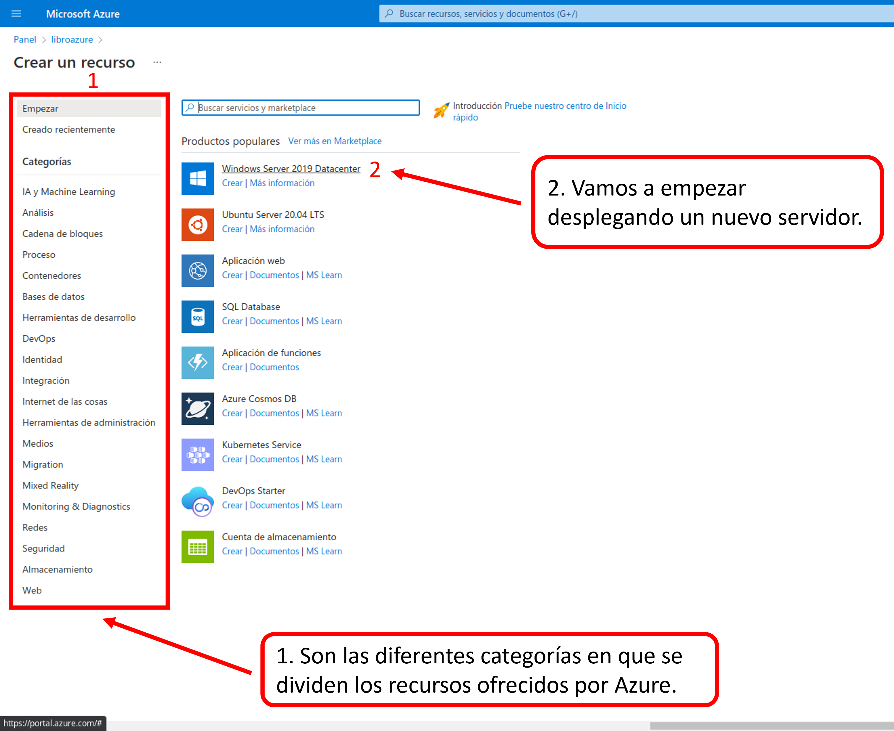
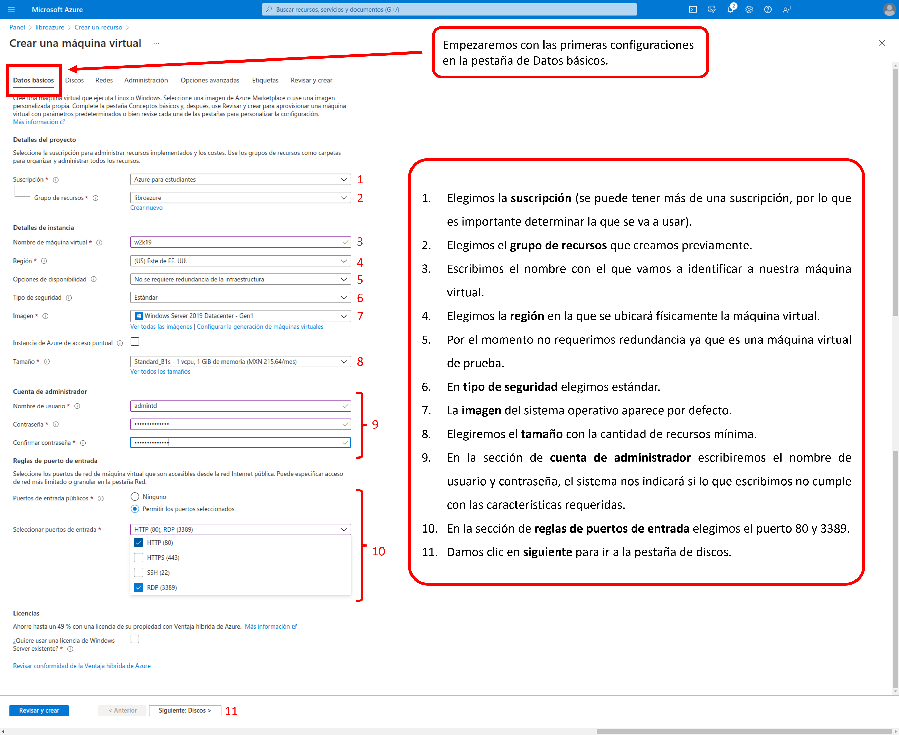
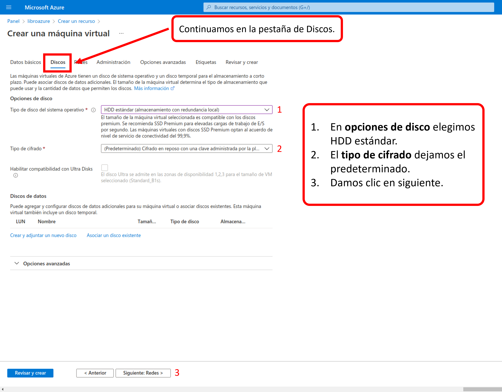
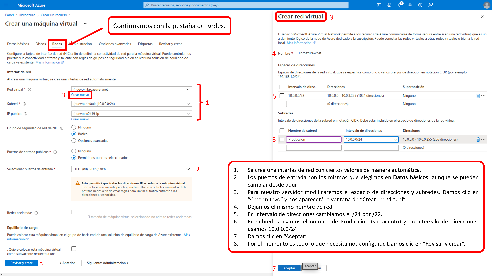
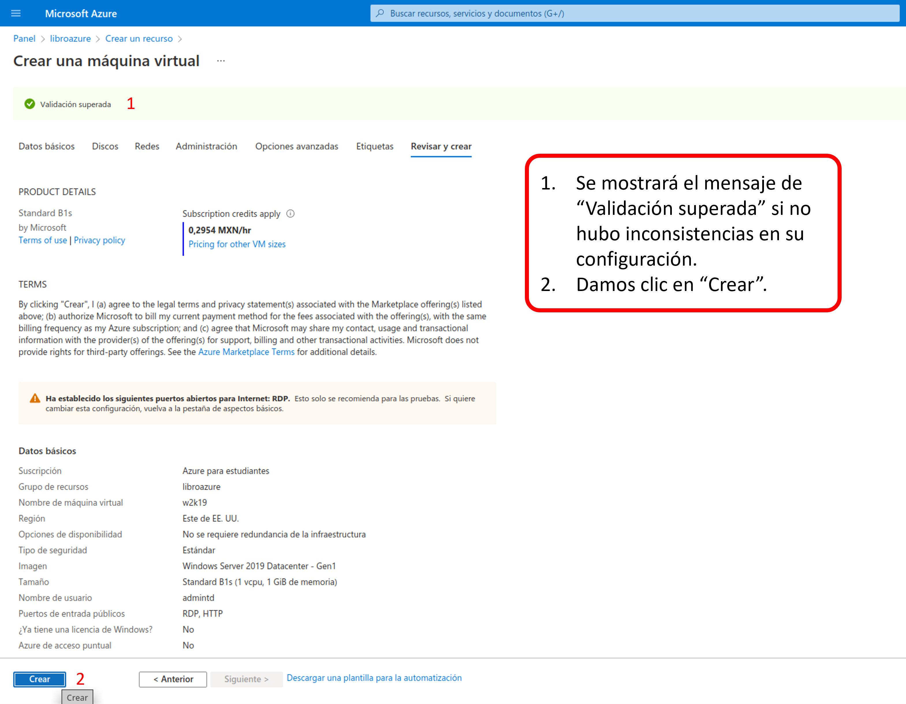
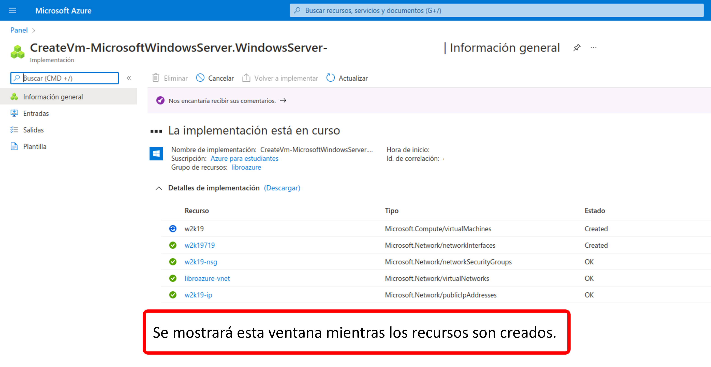
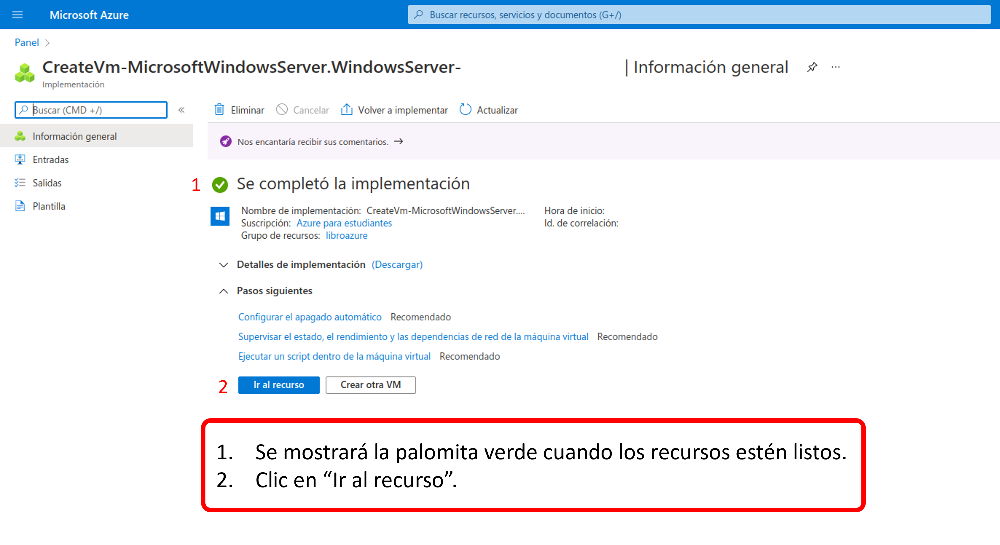
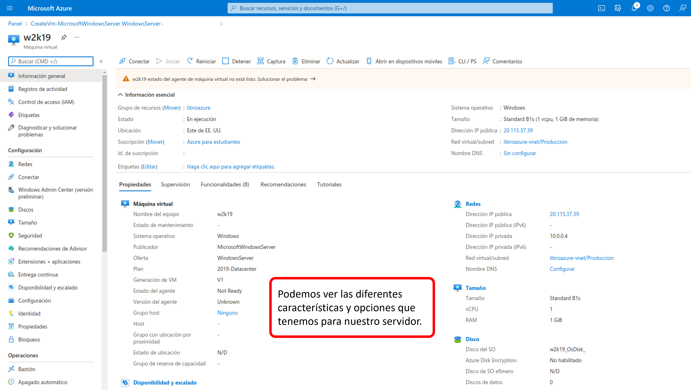

# CREACIÓN DE UN GRUPO DE RECURSOS Y UNA MÁQUINA VIRTUAL CON WINDOWS SERVER 2019

Esta guía es para mostrar los primeros pasos para crear un grupo de recursos e inmediatamente crear el primer recurso que será un máquina virtual con el sistema operativo Windows Server 2019.  

**Paso 1**

  

**Paso 2**
  

**Paso 3**
  

**Paso 4**
  

**Paso 5**

  
**Paso 6**
  

**Paso 7**
  

**Paso 8**
  

**Paso 9**
  

**Paso 10**
  

**Paso 11**

De esta forma disponemos de nuestros primeros recursos. En próximas publicaciones veremos cómo usarlos y configurarlos para su uso.